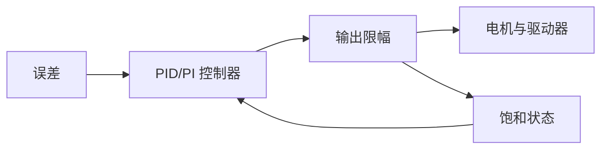

# 控制理论基础

本章给出电机控制中最常用的理论工具：反馈、PID、级联控制、带宽、稳定性和饱和处理。它不是完整控制理论教材，而是为理解各类电机控制方法提供统一语言。

## 本章目标

- 建立反馈控制、PID 和级联控制的统一表达。
- 理解采样周期、带宽、限幅和抗积分饱和对电机控制的影响。
- 为速度环、电流环、位置环设计提供理论背景。

## 前置知识

建议了解微积分、拉普拉斯变换的基本形式，以及 [电机控制总览](overview.md) 中的控制层级。

## 关键词汇与注释

| 中文术语 | English | 注释 |
| --- | --- | --- |
| 比例控制 | Proportional Control, P | 输出与当前误差成比例。 |
| 积分控制 | Integral Control, I | 输出与误差积分成比例，用于消除稳态误差。 |
| 微分控制 | Derivative Control, D | 输出与误差变化率成比例，用于增加阻尼。 |
| 带宽 | Bandwidth | 闭环系统能有效跟随信号变化的频率范围。 |
| 稳态误差 | Steady-state Error | 系统稳定后目标值与实际值之间的残余误差。 |
| 饱和 | Saturation | 控制输出受到电压、电流或占空比上限限制。 |
| 采样周期 | Sampling Period | 离散控制器两次计算之间的时间间隔。 |

## 反馈控制推导

设目标为 `r(t)`，输出为 `y(t)`，误差为：

```math
e(t)=r(t)-y(t)
```

PID 控制器输出：

```math
u(t)=K_p e(t)+K_i\int_0^t e(\lambda)d\lambda+K_d\frac{de(t)}{dt}
```

比例项提高响应速度；积分项让常值扰动下的稳态误差趋近于零；微分项抑制快速变化，但会放大测量噪声。因此电机速度环常用 PI，位置环常用 P 或 PID，电流环常用 PI。

离散控制器（Discrete Controller）按采样周期 `T_s` 周期性计算。常见离散 PID 可写为：

```math
u[k]=K_p e[k]+K_i T_s\sum_{n=0}^{k}e[n]+K_d\frac{e[k]-e[k-1]}{T_s}
```

这说明采样周期不是实现细节。若 `T_s` 改变而参数不重新解释，积分项和微分项的实际作用都会变化。

### PID 参数说明

| 参数 | English | 含义 | 常见单位 | 说明 |
| --- | --- | --- | --- | --- |
| `r(t)` | Reference | 目标输入 | 取决于对象 | 控制器希望系统达到的目标值，例如目标速度或目标位置。 |
| `y(t)` | Output | 实际输出 | 取决于对象 | 传感器或估算器得到的实际值。 |
| `e(t)` | Error | 误差 | 取决于对象 | 目标值与实际值的差。 |
| `u(t)` | Control Output | 控制输出 | 取决于驱动 | 控制器输出给驱动器或下一环的命令。 |
| `K_p` | Proportional Gain | 比例增益 | 取决于对象 | 误差当前值对输出的影响强度。 |
| `K_i` | Integral Gain | 积分增益 | 取决于对象 | 误差累积值对输出的影响强度，用于消除稳态误差。 |
| `K_d` | Derivative Gain | 微分增益 | 取决于对象 | 误差变化率对输出的影响强度，用于增加阻尼但会放大噪声。 |
| `T_s` | Sampling Period | 采样周期 | s | 离散控制器两次运行之间的时间间隔。 |
| `k` | Sample Index | 采样序号 | 1 | 离散时间下的第 `k` 次计算。 |

## 级联控制

电机常见级联结构是：


每个外环都给内环生成目标。内环必须比外环快，常见经验是内环带宽至少为外环的 5 到 10 倍。这个比例不是定律，但能避免外环命令变化超过内环执行能力。

带宽选择可按以下顺序理解：电流环最快，因为电流直接决定转矩；速度环较慢，因为机械惯量会限制加速度；位置环最慢，因为位置由速度积分得到。实际设计中还必须留出采样频率余量，闭环带宽不能接近采样频率，否则离散延迟和噪声会显著降低稳定裕度。

## 电流环

以直流电机为例，电气方程为：

```math
L\frac{di}{dt}+Ri=u-e
```

若在短时间内把反电动势 `e` 视为扰动，则电流被控对象为一阶系统：

```math
G_i(s)=\frac{I(s)}{U(s)}=\frac{1}{Ls+R}
```

PI 控制器：

```math
C_i(s)=K_p+\frac{K_i}{s}
```

闭环后积分项可消除常值反电动势扰动带来的电流误差。

## 速度环

机械方程为：

```math
J\frac{d\omega}{dt}+B\omega=\tau_e-\tau_L
```

若 `τ_e=K_t i`，且电流环足够快，可把电流近似看作速度环控制输入：

```math
G_\omega(s)=\frac{\Omega(s)}{I(s)}=\frac{K_t}{Js+B}
```

速度 PI 控制可消除常值负载转矩造成的稳态速度误差。

## 位置环

位置与速度关系为：

```math
\Theta(s)=\frac{1}{s}\Omega(s)
```

因此位置环天然多一个积分环节。若位置环增益过大，会使系统振荡。实际系统常采用位置 P 控制输出速度目标：

```math
\omega^*=K_{p\theta}(\theta^\ast-\theta)
```

并对 `ω^*` 限幅，避免位置误差过大时产生不可执行的速度命令。

## 饱和与抗积分饱和

控制输出受限于母线电压、电流限制和 PWM 最大占空比。当控制器进入饱和后，积分项若继续累积，会产生积分饱和。常见处理是：

```math
\dot{x}_I=
\begin{cases}
e, & \text{未饱和或误差使输出离开饱和}\\
0, & \text{饱和且误差继续推向饱和}
\end{cases}
```

其中 `x_I` 是积分状态。抗积分饱和能显著改善启动、堵转和急停后的恢复过程。

### 环路参数说明

| 参数 | English | 含义 | 常见单位 | 说明 |
| --- | --- | --- | --- | --- |
| `G_i(s)` | Current Plant | 电流环被控对象 | A/V | 描述电压输入到电流输出的动态关系。 |
| `G_ω(s)` | Speed Plant | 速度环被控对象 | rad/(s·A) | 描述电流输入到速度输出的动态关系。 |
| `C_i(s)` | Current Controller | 电流控制器 | - | 电流环中常用 PI 控制器。 |
| `x_I` | Integral State | 积分状态 | 取决于对象 | 控制器内部保存的误差累积量。 |
| `ω^*` | Speed Reference | 速度目标 | rad/s | 外环给速度环的目标值。上标 `*` 表示目标值或参考值。 |
| `θ^*` | Position Reference | 位置目标 | rad | 位置环希望达到的目标角度。 |

限幅与抗积分饱和的关系可以理解为：



当输出已被限幅时，控制器需要知道限幅状态，并停止或回退积分状态。否则系统恢复到可控区域后，累积的积分量会继续推动输出，造成过冲。

## 常见问题与误区

- 增大 `K_p` 不总是提升性能，过大时会放大噪声并引起振荡。
- 积分项能消除稳态误差，但会降低相位裕度并导致过冲。
- 微分项应谨慎用于带噪声的速度估计。
- 控制器参数必须和采样周期一起讨论，离散实现中采样周期改变会改变实际增益。

## 导航

[上一页：无刷电机控制](bldc-motor.md) | [返回目录](../README.md) | [下一页：必要硬件背景](hardware-background.md)
