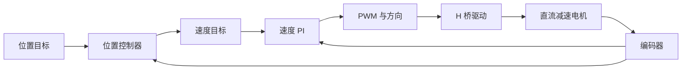

# 直流减速电机控制

直流减速电机（DC Geared Motor）是在直流电机后加入减速器（Gearbox）的执行器。相比普通 TT 电机，它可以覆盖更大功率和更高精度范围，常与编码器（Encoder）结合形成低成本伺服系统。

## 本章目标

- 理解减速器对速度、转矩和惯量的影响。
- 推导负载通过减速比折算到电机轴侧的方法。
- 建立速度环和位置环级联控制思路。

## 适合读者

适合需要控制轮式底盘、夹爪、升降机构、转台或低成本定位机构的读者。

## 前置知识

建议先阅读 [TT 电机控制](dc-tt-motor.md) 和 [控制理论基础](control-theory.md) 中的速度环、位置环部分。

## 基本结构与工作原理

电机本体产生高速低转矩输出，齿轮箱按减速比 `N` 把速度降低、转矩放大。若定义 `N=ω_m/ω_o`，其中 `ω_m` 是电机轴速度，`ω_o` 是输出轴速度，则理想关系为：

$$
\omega_o=\frac{\omega_m}{N}
$$

$$
\tau_o=\eta_g N\tau_m
$$

`η_g` 是齿轮箱效率（Gearbox Efficiency）。实际系统还存在齿隙、弹性、摩擦和传动误差。

## 关键词汇与注释

| 中文术语 | English | 注释 |
| --- | --- | --- |
| 减速比 | Gear Ratio | 电机轴速度与输出轴速度的比例。 |
| 等效惯量 | Reflected Inertia | 通过齿轮比折算到同一轴侧的惯量。 |
| 编码器 | Encoder | 测量角度或转速的传感器。 |
| 速度环 | Speed Loop | 使实际速度跟随目标速度的闭环。 |
| 位置环 | Position Loop | 使输出轴位置跟随目标位置的闭环。 |

## 数学模型与变量定义

电气侧仍满足：

$$
u_a = R_a i_a + L_a\frac{di_a}{dt}+K_e\omega_m
$$

电机侧转矩：

$$
\tau_m=K_t i_a
$$

负载惯量 `J_o` 折算到电机轴为：

$$
J_{ref}=\frac{J_o}{\eta_g N^2}
$$

因此电机轴等效机械方程为：

$$
\left(J_m+J_{ref}\right)\frac{d\omega_m}{dt}
+B_{eq}\omega_m+\tau_{f,eq}
+\frac{\tau_o}{\eta_g N}
=K_t i_a
$$

如果以输出轴建模，则：

$$
J_{o,eq}\frac{d\omega_o}{dt}+B_{o,eq}\omega_o+\tau_{f,o}+\tau_L
=\eta_g N K_t i_a
$$

推导的关键是功率近似守恒：

$$
\tau_m\omega_m \eta_g ≈ \tau_o\omega_o
$$

代入 `ω_m=Nω_o`，得到 `τ_o≈η_g N τ_m`。

## 常见控制目标

- 速度控制：电机输出恒定转速，抗负载扰动。
- 位置控制：输出轴到达目标角度或位移。
- 力矩限制：通过电流估计限制输出力，避免机械卡死。

## 主流控制方法

直流减速电机常用级联控制：

$$
e_\theta=\theta^*-\theta
$$

$$
\omega^\ast=K_{p\theta}e_\theta
$$

$$
e_\omega=\omega^\ast-\omega
$$

$$
u=K_{p\omega}e_\omega+K_{i\omega}\int e_\omega dt
$$

位置环输出速度目标，速度环输出电压或 PWM。若有电流采样，可再加入电流环，把速度环输出解释为目标电流。

## 控制框图

## 必要硬件背景

编码器分为增量式编码器（Incremental Encoder）和绝对式编码器（Absolute Encoder）。增量式编码器通过脉冲计数得到相对位置，通过单位时间内脉冲数估计速度；绝对式编码器能直接给出角度编码。

驱动器需要覆盖启动电流和堵转电流。若只按空载电流选驱动，系统在启动、急停或卡滞时容易过流。

## 优缺点与适用场景

优点是输出转矩大、控制方式成熟、可低成本实现速度和位置控制。缺点是齿隙影响反向精度，齿轮箱磨损会改变模型参数。适合小型移动机器人、夹爪、升降机构和中低精度定位。

## 常见问题与误区

- 减速比越大不一定越好；高减速比降低速度和回驱能力，也放大齿隙影响。
- 编码器装在电机轴时分辨率高，但不能直接反映输出轴齿隙后的真实位置。
- 速度估计窗口太短会噪声大，窗口太长会延迟大。

## 导航

[上一页：TT 电机控制](dc-tt-motor.md) | [返回目录](../README.md) | [下一页：步进电机控制](stepper-motor.md)
