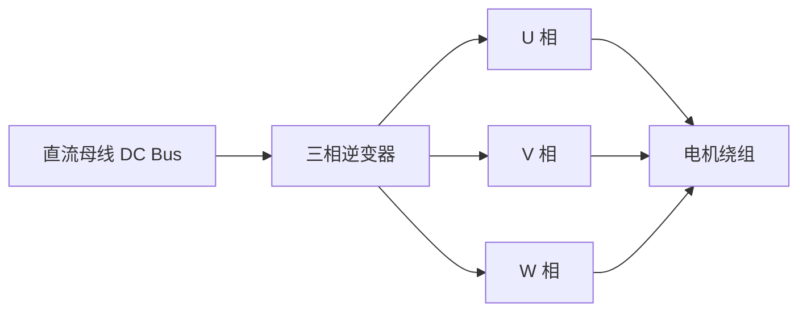

# 必要硬件背景

电机控制算法最终必须通过功率硬件作用到绕组上。本章只解释理解控制方法所需的硬件概念，不作为完整硬件设计指南。

## 本章目标

- 理解电机控制算法与功率驱动硬件之间的关系。
- 认识 H 桥、三相逆变器、电流采样、传感器和基础保护。
- 为阅读各电机专题中的硬件背景打基础。

## 适合读者

适合希望理解驱动器、传感器和保护概念，但暂时不做完整硬件设计的读者。

## 前置知识

建议了解基础电路中的电压、电流、开关器件和电源概念。

## 关键词汇与注释

| 中文术语 | English | 注释 |
| --- | --- | --- |
| H 桥 | H-Bridge | 四个开关组成的桥式电路，可给直流电机施加正反向电压。 |
| 三相逆变器 | Three-phase Inverter | 六个功率开关组成，用于驱动 BLDC 或 PMSM。 |
| MOSFET | Metal-Oxide-Semiconductor Field-effect Transistor | 常用功率开关器件。 |
| 栅极驱动器 | Gate Driver | 驱动 MOSFET 栅极快速充放电的电路。 |
| 电流采样 | Current Sensing | 测量绕组或母线电流，用于保护和电流闭环。 |
| 编码器 | Encoder | 测量位置或速度的传感器。 |
| 死区时间 | Dead Time | 同一桥臂上下开关都关断的一小段时间，用于避免直通。 |

## H 桥

H 桥可控制直流电机两端电压极性。理想状态下，正转时一对对角开关导通，反转时另一对导通。PWM 可施加在高边或低边开关上，实现平均电压调节。

需要避免同一桥臂上下管同时导通，这种故障称为直通（Shoot-through），会造成母线短路。实际驱动器会加入死区时间（Dead Time）。死区时间过短会增加直通风险，过长会引入电压误差和电流畸变。

## 三相逆变器

BLDC 和 FOC 控制使用三相逆变器：



六个 MOSFET 按 PWM 策略生成三相电压。六步换相直接选择导通相，FOC 通常使用 SVPWM 生成更平滑的三相电压矢量。

## 电流采样

常见采样方式包括：

| 方式 | 特点 |
| --- | --- |
| 低边采样 | 成本低，但采样窗口受 PWM 状态限制。 |
| 相电流采样 | 可直接获得相电流，硬件成本较高。 |
| 母线采样 | 只能在特定开关状态下推断相电流。 |

电流采样既用于控制，也用于保护。若没有可靠电流限制，堵转和短路可能快速损坏驱动器或电机。

## 位置与速度传感器

编码器适合精确位置和速度反馈。霍尔传感器（Hall Sensor）常用于 BLDC 换相，分辨率较低但可靠。反电动势检测适合中高速无感控制，低速时信噪比差。

速度可由位置差分得到：

```math
\omega[k]≈\frac{\theta[k]-\theta[k-1]}{T_s}
```

其中 `T_s` 是采样周期（Sampling Period）。差分会放大位置量化噪声，因此实际系统常加入滤波或使用更长计数窗口。

## 电源与保护

电机是强扰动负载，启动、制动、堵转和反转会产生大电流。常见保护包括过流保护（Over-current Protection）、过温保护（Over-temperature Protection）、欠压保护（Under-voltage Lockout）和反接保护（Reverse Polarity Protection）。

制动时，机械能可能回灌到母线，使母线电压上升。系统需要通过电源吸收能力、制动电阻或控制策略处理再生能量。

## 常见问题与误区

- 只看额定电流选驱动器不够，启动和堵转电流更关键。
- PWM 频率过低会带来可闻噪声，过高会增加开关损耗。
- 没有电流采样也能开环驱动，但难以实现可靠保护和高性能控制。

## 导航

[上一页：控制理论基础](control-theory.md) | [返回目录](../README.md) | [下一页：电机类型对比](comparison.md)
