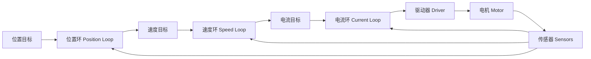

# 电机控制总览

电机控制（Motor Control）是通过电压、电流、磁场或换相时序，使电机输出期望转矩、速度或位置的技术。不同电机结构不同，但控制问题通常可以拆成三层：电流控制（Current Control）、速度控制（Speed Control）和位置控制（Position Control）。

## 本章目标

- 建立电机控制的通用框架。
- 区分开环、闭环、转矩控制、速度控制和位置控制。
- 为后续阅读各类电机专题提供统一术语。

## 适合读者

适合第一次系统阅读本 wiki 的读者，也适合已经会让电机转动、但希望理解控制层级的人。

## 前置知识

建议了解电压、电流、电阻、电感和基础力学中的转矩、速度、位置概念。不要求先掌握控制理论。

## 关键词汇与注释

| 中文术语 | English | 注释 |
| --- | --- | --- |
| 开环控制 | Open-loop Control | 控制器不测量输出结果，只按预设输入驱动电机。 |
| 闭环控制 | Closed-loop Control | 控制器测量输出并修正误差，抗扰动能力更强。 |
| 占空比 | Duty Cycle | PWM 高电平时间占周期的比例，常用于调节等效电压。 |
| 反电动势 | Back Electromotive Force, Back-EMF | 电机转动时产生的感应电压，方向通常抵消外加电压。 |
| 转矩常数 | Torque Constant | 电流与输出电磁转矩之间的比例系数。 |
| 级联控制 | Cascade Control | 外环给内环设定值，例如位置环给速度环目标。 |

## 控制目标

电机控制的目标通常不是“让电机转起来”这么简单，而是让某个物理量按要求变化：

- 转矩控制（Torque Control）：要求输出力矩稳定，常依赖电流环。
- 速度控制（Speed Control）：要求角速度跟随目标，常用于车轮、风扇、传送带。
- 位置控制（Position Control）：要求转角或位移到达目标，常用于机械臂、云台、直线模组。

三类目标之间存在自然层级。电磁转矩通常由绕组电流决定，速度由转矩和负载动力学决定，位置由速度积分得到。

## 控制层级



最内层通常最快，因为电流变化直接决定电磁转矩。速度环慢于电流环，位置环慢于速度环。若内环响应太慢，外环会把未被内环消化的误差继续放大，导致振荡。

## 通用数学关系

电机机械侧可以抽象为：

```math
J\frac{d\omega}{dt}+B\omega+\tau_L=\tau_e
```

其中，`J` 是转动惯量（Moment of Inertia），`B` 是粘性阻尼系数（Viscous Damping Coefficient），`ω` 是角速度（Angular Velocity），`τ_L` 是负载转矩（Load Torque），`τ_e` 是电磁转矩（Electromagnetic Torque）。

### 参数说明

| 参数 | English | 含义 | 常见单位 | 说明 |
| --- | --- | --- | --- | --- |
| `J` | Moment of Inertia | 转动惯量 | kg·m² | 描述转子和负载抵抗角加速度变化的能力。`J` 越大，同样转矩下加速越慢。 |
| `B` | Viscous Damping Coefficient | 粘性阻尼系数 | N·m·s/rad | 描述速度越高阻力越大的摩擦或阻尼项。 |
| `ω` | Angular Velocity | 角速度 | rad/s | 描述电机轴或输出轴转动快慢。 |
| `θ` | Angular Position | 角位置 | rad | 描述旋转位置，速度 `ω` 对时间积分后得到位置 `θ`。 |
| `τ_L` | Load Torque | 负载转矩 | N·m | 外部机械负载施加到电机轴上的阻力矩或扰动力矩。 |
| `τ_e` | Electromagnetic Torque | 电磁转矩 | N·m | 电机电磁作用产生的输出转矩，是驱动机械系统运动的主要来源。 |

由角速度积分得到位置：

```math
\theta(t)=\theta(0)+\int_0^t \omega(\lambda)d\lambda
```

这说明位置控制必然依赖速度动态，速度控制又依赖转矩动态，而转矩通常与电流相关。

## 四类电机的控制差异

| 类型 | 主要控制量 | 是否天然适合开环 | 典型反馈 |
| --- | --- | --- | --- |
| TT 电机 | PWM 等效电压、速度 | 可以，但精度低 | 编码器、测速模块 |
| 直流减速电机 | 电压、电流、速度、位置 | 可以，但受负载影响明显 | 编码器、电流采样 |
| 步进电机 | 脉冲频率、步数、相电流 | 是，但会失步 | 编码器可选 |
| 无刷电机 | 三相电流、换相角、电角度 | 通常需要换相信息 | 霍尔、编码器、反电动势 |

## 常见误区

- PWM 不是直接控制速度，而是改变平均电压；实际速度还受负载、摩擦和反电动势影响。
- 步进电机开环能定位，但不能证明实际已经到位；超过转矩能力会失步。
- 无刷电机不是“直流电机加电子换向”这么简单，高性能控制需要电角度和电流矢量控制。
- PID 不是万能参数表，必须和被控对象带宽、采样周期、饱和限制一起考虑。

## 导航

[返回目录](../README.md) | [下一页：阅读路线](reading-map.md)
